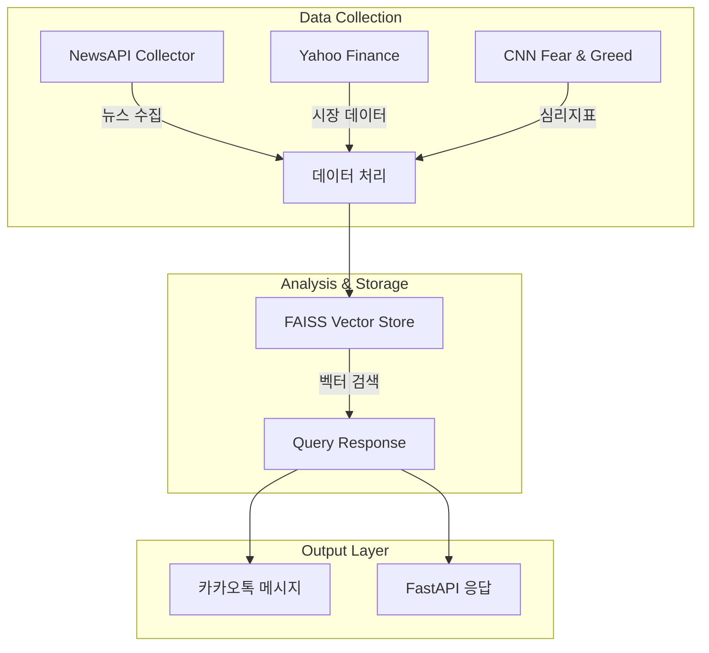

# 🎯 AI 기반 투자 결정 지원 카카오톡 챗봇 (AI-Powered Investment Decision Support Kakaotalk ChatBot)

[](https://www.python.org/downloads/)
[](https://python.langchain.com/)
[](https://fastapi.tiangolo.com/)
[](https://opensource.org/licenses/MIT)


<a name="korean"></a>

NewsAPI, Yahoo Finance, CNN Fear & Greed Index의 데이터를 수집하고 LangChain과 FAISS를 활용하여 매일 뉴스와 주식 시장 상황 정보를 제공하는 카카오톡 챗봇입니다. 


# 📌 목차

1. [소개](#🌟-소개)
2. [핵심 기능](#🌟-핵심-기능)
3. [주요 기능](#✨-주요-기능)
4. [데이터 수집 및 처리](#📊-데이터-수집-및-처리)
   - [시장 데이터 (Yahoo Finance)](#시장-데이터-yahoo-finance)
   - [뉴스 데이터 (NewsAPI)](#뉴스-데이터-newsapi)
   - [투자 심리 지표](#투자-심리-지표)
5. [데이터 시각화](#📊데이터-시각화)
6. [시스템 구조](#🏗-시스템-구조)
7. [LangChain을 통한 LLM 사용](#langchain을-통한-llm-사용)
8. [카카오톡 챗봇 서버 구현](#카카오톡-챗봇-서버-구현)
9. [RAG, LLM을 이용한 뉴스 번역과 요약](#rag-llm을-이용한-뉴스-번역과-요약)
10. [스케줄링](#scheduling)
11. [설치 방법](#🚀-설치-방법)
12. [API 문서](#📚-api-문서)
13. [관련 문서](#관련-문서)
14. [기술 스택](#🛠-기술-스택)
15. [프로젝트 구조](#📂-프로젝트-구조)
16. [팀 구성](#👥-팀-구성)
17. [프로젝트 고찰 및 후기](#🤔-프로젝트-고찰-및-후기)
18. [향후 계획](#향후-계획)
19. [라이센스](#📄-라이센스)
20. [연락처](#📞-연락처)

## 🌟 소개
매일 해외 주요 뉴스와 시장 정보를 수집해 투자 인사이트를 제공하는 카카오톡 챗봇입니다.

http://pf.kakao.com/_lmNxdn 채널을 추가하거나 채팅을 통해 바로 사용해보세요.

**서버 운영 : 24.12.11 ~ 24.12.26(종료) **


## 🌟 핵심 기능

- **매일 제공되는 시장 정보** : 매일 업데이트되는 정보로 간단히 아침에 시장 동향을 파악할 수 있게 합니다.
- **Like ChatGPT**: 카카오톡 채팅창을 통해 어떤 것이든 바로 질문하고 답변받을 수 있습니다.
- **최신 데이터 검색**: 검색을 통해 최신 정보도 찾아볼 수 있습니다.

** 본래 매일 아침 채널을 추가한 사용자에게 정보를 자동으로 제공하는 기능으로(서버가 선톡) 구현하는 것이 목표였지만, [카카오톡 정책](https://kakaobusiness.gitbook.io/main/tool/chatbot/main_notions/event-api)에 따라 사업자등록증이 필요하였기에 유저가 클릭을 통해 정보를 받아오는 방식으로 구현하였습니다.**

## ✨ 주요 기능

<br>http://pf.kakao.com/_lmNxdn 채널을 추가하거나 바로 채팅을 통해 사용해볼 수 있습니다.<br><br>


<br>**오늘의 뉴스**  : 오늘 시장 동향에 관한 뉴스를 살펴봅니다. <br><br>


<br>**/v [질문]** : 오늘의 뉴스 내용 또는 오늘 주가에 대해 더 자세히 알아볼 수 있습니다.<br><br>


<br>**/s [질문]** : 어떤 질문이든, 최신 정보를 검색해볼 수 있습니다. 자주 사용하면 트래픽 제한으로, 응답하지 않을 수 있습니다. 시간이 조금 소요됩니다.<br><br>


<br>**[질문]** : 어떤 질문이든, ChatGPT처럼 답변을 받아볼수 있습니다.<br><br>


<br>**Fear & Greed, Dashboard** : 시장 동향에 대해 간단히 알아볼 수 있습니다.<br><br>


<br>**상관관계** : 주요 지수에 관한 correlation matrix를 출력합니다..<br><br>


# 개발 과정
# 📊 데이터 수집 및 처리

## **데이터 수집 및 처리 개요**

### **시장 데이터 (Yahoo Finance)**

- 실시간 주식 시장 데이터
- 글로벌 시장 지표
- 주요 주식 상세 정보

### **뉴스 데이터 (NewsAPI)**

- 실시간 금융 뉴스 수집
- 글로벌 경제 동향 모니터링
- AI 기반 뉴스 요약

### **투자 심리 지표**

- CNN Fear & Greed Index
- 일일 변동성 분석

## **시장 데이터 (Yahoo Finance)**

`yfinance` 라이브러리를 사용하여 실시간 금융 시장 데이터를 수집:

### **로직 설명**

- 주요 글로벌 지수(S&P 500, NASDAQ 등), 국채 수익률, 원자재 가격, 주요 기술주 데이터를 조회합니다.
- `get_market_summary` 메서드를 통해 모든 심볼의 데이터를 한 번에 가져오며, 데이터는 `price`, `change_percent`, `volume`와 같은 세부 정보로 저장됩니다.
- 수집된 데이터는 JSON 형식으로 저장되거나 즉시 대시보드로 전송될 수 있습니다.

### **예시 코드**

```python
# YahooFinance 클래스를 이용한 시장 데이터 수집
collector = YahooFinance()
market_data = collector.get_market_summary()
```

### **수집 데이터 카테고리**

- **글로벌 지수**: S&P 500, NASDAQ, DOW 등
- **국채 수익률**: 2년, 5년, 10년, 30년
- **원자재**: 금, 은, 원유, 천연가스
- **주요 기술주**: FAANG 기업 (Facebook, Apple, Amazon, Netflix, Google)

---

## **뉴스 데이터 (NewsAPI & RSS)**

다중 소스에서 실시간 뉴스를 수집하고 LLM(Large Language Models)을 활용하여 분석:

### **로직 설명**

- `NewsAPI`를 통해 주요 글로벌 뉴스를 수집하고, 추가적으로 RSS 피드 데이터를 통합합니다.
- `collect_all_news` 메서드는 수집된 뉴스를 중요도와 신뢰도를 기반으로 정렬하고, 주요 기사만 저장하거나 LLM 분석으로 전송합니다.
- 데이터는 JSON 파일 형식으로 저장되며, 필요 시 요약 결과를 반환합니다.

### **예시 코드**

```python
# NewsCollector 클래스를 이용한 뉴스 수집
collector = NewsCollector(api_key=NEWS_API_KEY)
news_data = collector.collect_all_news()
```

### **뉴스 소스**

- **NewsAPI**: 주요 글로벌 뉴스 매체
- **RSS 피드**: Yahoo Finance, MarketWatch, Reuters
- **신뢰 기반 필터링**: 신뢰도를 기준으로 뉴스 필터링 시스템 적용

---

## **투자 심리 분석**

CNN Fear & Greed Index를 실시간으로 추적하여 시장 심리를 모니터링:

### **로직 설명**

- CNN의 Fear & Greed API에서 심리 지표를 수집하며, 데이터가 없을 경우 웹 스크래핑 대체 로직을 실행합니다.
- `get_fear_greed_data` 메서드는 지수 데이터를 `timestamp`와 함께 JSON 형식으로 반환하며, 파일로 저장하거나 대시보드로 전송합니다.

### **예시 코드**

```python
# CNNFearGreedIndex 클래스를 이용한 심리 분석
collector = CNNFearGreedIndex()
mood_data = collector.get_fear_greed_data()
```

### **지표 구성 요소**

- 주가 모멘텀
- 시장 변동성
- 투자자 심리
- 안전자산 수요

---

### **LLM 전송 로직**

- 수집된 모든 데이터는 JSON 형식으로 변환하여 LLM에 전송됩니다.
- LLM의 응답은 주요 요약 데이터 또는 추가 분석 결과로 활용됩니다.
- 저장된 데이터는 `.json` 및 `.csv` 형식으로 유지하며, 추후 재분석에 사용됩니다.

## **데이터 수집 및 처리 개요**

### **시장 데이터 (Yahoo Finance)**

- 실시간 주식 시장 데이터
- 글로벌 시장 지표
- 주요 주식 상세 정보

### **뉴스 데이터 (NewsAPI)**

- 실시간 금융 뉴스 수집
- 글로벌 경제 동향 모니터링
- AI 기반 뉴스 요약

### **투자 심리 지표**

- CNN Fear & Greed Index
- 일일 변동성 분석

## 📊데이터 시각화

금융 시장 데이터를 시각화하여 사용자가 이해하기 쉽게 제공합니다. 아래는 프로젝트에서 생성하는 주요 이미지 분석 결과의 예시입니다.

### 1. 상관관계 매트릭스

시장의 주요 지수, 기술주 간 상관관계를 시각화한 매트릭스입니다.


### 2. Fear & Greed 게이지

시장 심리 지표(Fear & Greed Index)를 시각적으로 표시하여 투자자의 심리 상태를 이해할 수 있도록 합니다.


### 3. 주요 지수 테이블

주요 지수들의 현재가, 변동폭, 거래량을 테이블 형태로 제공합니다.


### 4. 원자재 가격 분석

원자재 데이터의 현재가, 변동폭, 거래량을 시각적으로 제공합니다.


### 5. 기술주 데이터 테이블

기술주 데이터의 현재가, 변동폭, 거래량을 테이블로 제공합니다.


### 6. 국채 수익률 테이블

국채 수익률 데이터를 현재가, 변동폭으로 정리하여 제공합니다.


### 7. 시장 개요 차트

시장의 주요 자산군별 일일 변동폭을 차트로 시각화하여 제공됩니다.


## 🏗 시스템 구조



### 데이터 활용

- 이러한 시각화 결과를 통해 사용자는 시장의 흐름을 보다 직관적으로 파악할 수 있습니다.
- 시각화 이미지는 매일 업데이트되며, 카카오톡 알림 및 대시보드에 반영됩니다.

---
# LangChain을 통한 LLM 사용

- LangChain은 AI 애플리케이션 개발을 돕는 Python 및 JavaScript 기반의 오픈소스 프레임워크입니다.
- [Langchain Docs](https://python.langchain.com/docs/introduction/)

아래와 같이 간단한 코드로 LLM 응답을 받을 수 있습니다.


해당 프로젝트에서는, ChatGroq api를 통한 Meta의 LLAMA-3.1-8b-instant를 사용했습니다.


더 큰 모델인 llama-3.1-70b-versatile을 사용하고 싶었지만, 당연하게도 로컬로 돌릴 수는 없어서, api를 사용했기 때문에 사용량 제한이 있어 작은 모델을 사용할 수밖에 없었습니다.

```
from langchain_groq import ChatGroq
from langchain.chains import LLMChain

def getResponseFromLLAMA(prompt):
    llm = ChatGroq(model="llama-3.1-8b-instant")#llama-3.1-70b-versatile
    combine_prompt = PromptTemplate(input_variables=['text'], template="You are an participatnt in 1:1 dialogue. Response about quesition. : {text}.")
    chain = LLMChain(llm=llm, prompt=combine_prompt, verbose=True)
    response = chain.invoke({'text':prompt})
    return response['text']
```

# 카카오톡 챗봇 서버 구현

## 기본 개념

카카오톡 메시지를 보내면, 기본적으로 아래와 같은 json 데이터가 전송되게 됩니다.


```
{
  "intent": {
    "id": "cw3p5xzzseejg0exb77o5d9a",
    "name": "블록 이름"
  },
  "userRequest": {
    "timezone": "Asia/Seoul",
    "params": {
      "ignoreMe": "true"
    },
    "block": {
      "id": "cw3p5xzzseejg0exb77o5d9a",
      "name": "블록 이름"
    },
    "utterance": "발화 내용",
    "lang": null,
    "user": {
      "id": "017194",
      "type": "accountId",
      "properties": {}
    }
  },
  "bot": {
    "id": "673c50f3ce60fd538c831cea",
    "name": "봇 이름"
  },
  "action": {
    "name": "7staa5xorm",
    "clientExtra": null,
    "params": {},
    "id": "0686dfccivppypyoclzt1zcn",
    "detailParams": {}
  }
}
```

잠시 용어를 정리하자면 ,

- 사용자 발화 : 유저가 입력한 채팅
- 블럭 : 유저 입력에 따른 응답의 기본 단위
- 폴백 블록 : 유저 입력이 미리 입력한 패턴과 일치하지 않았을 떄의 응답(ex : 이해할 수 없는 질문이에요.)
- 스킬 : 블록에 종속되어 사용자에게 응답을 돌려주는 기능


여기서 봇 응답을 스킬데이터로 사용한다면, 서버에서 받은 스킬 데이터를 답장으로 내보낼 수 있게 됩니다. [**카카오톡 비즈니스 가이드**](https://kakaobusiness.gitbook.io/main/tool/chatbot/skill_guide/answer_json_format)를 보면, 어떤 json 포맷이 어떠한 형식의 응답으로 나타는지 확인할 수 있습니다.

이번 프로젝트에서는, 유저가 어떤 패턴의 발화를 할지 알 수 없기 때문에 폴백 블록과 스킬 서버를 연결해서, 유저의 모든 발화에 대해 스킬서버가 응답하게 했습니다.


---

## 서버 만들기
```
# server.main.py

@app.post("/chat/")
async def chat(request: Request):
    kakaorequest = await request.json()
    # request에 URL이 포함되어있지 않아서 넣어줘야 한다
    scope = request.scope 
    scheme = scope.get("scheme", "http")
    host = scope["headers"][0][1].decode("utf-8")  # Host 헤더에서 호스트 정보 가져오기(base url넘기기)
    path = scope["path"]
    url = f"{scheme}://{host}{path}"
    kakaorequest["base_url"] = url
    #print(json.dumps(kakaorequest, indent=2))
    return mainChat(kakaorequest)
    
    
    def post_in_background(url, data, headers):
    # 별도 스레드에서 POST 요청 처리
    r = requests.post(url, data=json.dumps(data), headers=headers)
    print("POST 요청 상태코드:", r.status_code)
    print("POST 응답 본문:", r.text)

def wait_and_post(response_queue, url, headers):
    # response_queue에 응답이 들어올 때까지 대기
    response = response_queue.get()  # 여기서 블로킹되어 응답을 기다림
    # 응답이 들어오면 post_in_background 실행
    post_in_background(url, response, headers)

def mainChat(kakaorequest):
    start_time = time.time()
    cwd = os.getcwd()
    filename = os.path.join(cwd, "botlog.txt")
    if not os.path.exists(filename):
        with open(filename, "w") as f:
            f.write("")

    response_queue = q.Queue()
    request_respond = threading.Thread(target=AI_Response, args=(kakaorequest, response_queue, filename))
    request_respond.start()

    target_url = kakaorequest["userRequest"]["callbackUrl"]
    headers = {"Content-Type": "application/json"}

    delayedResponse = {
        "version": "2.0",
        "useCallback": "true",
        "data": {
            "text": "생각하고 있는 중이에요😘\n최대 1분 정도 소요될 거 같아요. 기다려 주실래요?!"
        }
    }

    immediateResponse = {
        "version": "2.0",
        "useCallback": "true",
        "data": {
        }
    }

    max_wait_time = 3.5
    response_data = None

    # 최대 3.5초 대기하며 queue 확인
    while (time.time() - start_time) < max_wait_time:
        if not response_queue.empty():
            # 큐가 차있다면 즉시 응답 반환
            response_data = response_queue.get()
            break
        time.sleep(0.1)  # 0.1초 간격으로 큐 상태 확인

    if response_data is not None:
        # 3.5초 이내 응답 도착 시 immediateResponse 반환
        client_response = Response(content=json.dumps(immediateResponse), media_type='application/json')
    else:
        # 3.5초 동안 대기했는데도 응답이 없다면 delayedResponse 반환
        client_response = Response(content=json.dumps(delayedResponse), media_type='application/json')

    # 반환 후에도 응답이 나중에 들어오면 post_in_background 호출
    def wait_and_post():
        if response_data is None:
            # 아직 응답을 못받은 경우 큐에 응답 들어올 때까지 대기
            final_response = response_queue.get()
        else:
            # 이미 response_data가 있는 경우 바로 사용
            final_response = response_data

        post_in_background(target_url, final_response, headers)

    threading.Thread(target=wait_and_post).start()

    return client_response

```

**데이터 흐름**을 살펴보면,

1. **사용자 요청 수신**  
   - `/chat/` 엔드포인트로 카카오톡에서 전송한 JSON 데이터(`kakaorequest`)를 수신합니다.
   - 받은 요청 데이터에 `base_url` 정보를 추가합니다.

2. **비동기 응답 처리 시작**  
   - `mainChat()` 함수를 통해 응답 처리 로직을 수행합니다.
   - `AI_Response` 함수를 별도 스레드로 실행하여 AI 응답을 비동기적으로 생성합니다.
   - 이 스레드의 결과는 `response_queue`를 통해 전달됩니다.

3. **3.5초 제한 대기 로직**  
   - 메인 흐름은 최대 3.5초 동안 `response_queue`를 모니터링합니다.
   - 3.5초 이내 응답이 도착하면 `immediateResponse`를,  
     도착하지 않으면 임시 안내 메시지(`delayedResponse`)를 즉시 반환합니다.
    - 3.5초 이내 응답이 도착하지 않으면 상대방에게 `생각하고 있는 중이에요😘\n최대 1분 정도 소요될 거 같아요. 기다려 주실래요?!`가 전송되고, 그 전에 응답이 도착하면 바로 답장이 전송됩니다. 
    - [카카오 비즈니스 - AI 챗봇 콜백 개발 가이드](https://kakaobusiness.gitbook.io/main/tool/chatbot/skill_guide/ai_chatbot_callback_guide)에서 콜백을 어떻게 사용하는지 확인할 수 있습니다.

4. **콜백 URL을 통한 최종 응답 전송**  
   - `immediateResponse` 혹은 `delayedResponse`이  반환한 뒤에도, 백그라운드 스레드(`wait_and_post`)를 통해 최종 AI 응답(`response_data`)이 준비되면 `post_in_background()`로 `callbackUrl`에 POST 요청을 전송합니다.
  
상세한 ResponseHandler는 server/components/responseHandlers.py에서 확인할 수 있습니다.

---
## RAG, LLM을 이용한 뉴스 번역과 요약

## 검색 증강 생성(Retrieval Augmented Generation, RAG)이란?
LLM은 **학습한 데이터**를 바탕으로 응답을 생성합니다. 당연하게도 학습하지 못한 데이터(회사 내부 문서, 강의자료 pdf,  최신 뉴스 등등)에 대해서는 잘못된 답변을 하거나 모른다고 응답하기도 합니다.


 RAG는 Retrieval(검색), Augmentation(증강), Generation(생성)의 세 단계로 이루어져 있습니다.
 

### 1. Retrieval (검색)
- 사용자의 질문에 대해 관련 있는 정보를 외부 데이터 소스(예: 벡터 데이터베이스, 문서, API 등)에서 검색합니다.
- 벡터 데이터베이스를 사용하는 경우, 질문을 임베딩으로 변환한 후(임베딩 모델 사용) 유사한 문서를 검색(코사인 유사도)하여 결과를 반환합니다.
- 검색된 문서나 데이터는 이후 단계에서 모델의 입력으로 사용됩니다.

### 2. Augmentation (증강)
- 검색된 데이터를 기반으로 입력 데이터를 보강하여 모델에 제공할 컨텍스트를 생성합니다.
- 검색된 문서에서 텍스트를 추출하거나, 여러 문서를 검색하거나, 데이터를 활용하여 더 나은 질문 생성 등이 포함됩니다.

### 3. Generation (생성)
- 증강된 데이터를 언어 모델(LLM)의 입력으로 제공하여 사용자의 질문에 대한 최종 답변을 생성합니다. (데이터와 유저 질문을 같이 LLM으로 넘긴다고 생각하면 됩니다.)

---
## RAG 구현
### Vector Store 구축
아래는 프로젝트에서 사용된 코드의 일부입니다.
아래 코드에서 다음과 같은 과정을 거친 것을 확인할 수 있습니다.

####  1. 영어 기사를 한글로 번역
#### 2. {제목 : 내용} 형태로 문서(Document) 만들기
#### 3. 문서를 Huggingface 한국어 모델로 임베딩
#### 4. FAISS 문서 저장소를 이용해서 저장
```
#server/component/summerize/pick_and_summerize.py

with open(f'./data/raw/news/collected_news_{datetime.now().strftime('%Y%m%d')}.json', 'r', encoding='utf-8') as f:
    data = json.load(f)
dotenv.load_dotenv()
articles = data['articles']

# LLM을 이용한 번역
def translate_text(text, source_language, target_language):
    template = f"Translate the following text from {source_language} to {target_language} preserving the original meaning:\n\n{text}\n\nTranslation:"
    llm = ChatGroq(model="llama-3.1-8b-instant")
    prompt = PromptTemplate(template=template, input_variables=['text'])
    chain = LLMChain(llm=llm, prompt=prompt, verbose=True)
    response = chain.invoke({'text':prompt})
    return response['text'].strip()

# 기사 내용 추출 및 Document 객체화해서 vector store 구축
documents = []
for idx, article in enumerate(articles):
    content = article.get('full_content')
    if content:
        doc = Document(
            page_content = translate_text(content, 'English', 'Korean'),
            metadata={
                'id': idx,
                'title' : article.get('title')
            }
        )
        documents.append(doc)
        
for doc in documents:
    print("===== Document =====")
    print("ID:", doc.metadata['id'])
    print("제목:", doc.metadata['title'])
    print("내용:")
    print(doc.page_content)
    print("====================\n")

# 뉴스는 길어서 모델에 한 번에 안 들어간다
text_splitter = RecursiveCharacterTextSplitter(chunk_size=500, chunk_overlap=100)
chunks = text_splitter.split_documents(documents)

# vector space 생성 
# HuggingFaceEmbeddings를 사용하여 임베딩 모델 로드
#embedding_model = HuggingFaceEmbeddings(model_name='sentence-transformers/all-MiniLM-L6-v2')
embedding_model = HuggingFaceEmbeddings(
    model_name='jhgan/ko-sbert-nli',
    model_kwargs={'device':'cpu'},
    encode_kwargs={'normalize_embeddings':True},
)
vector_store = FAISS.from_documents(chunks,
                                    embedding = embedding_model,
                                    )
vector_store.save_local('./db/faiss')
```


아래는 동일한 방법으로, 받아온 주가 정보를 벡터 임베딩하여 vector store를 구축한 코드입니다.

```
#src/data_processing/cnn_fear_greed_visualization.py
       # 기존 인덱스 로드
        db = FAISS.load_local("./db/faiss", embedding_model, allow_dangerous_deserialization=True)

        # 새로운 문서 추가
        for symbol, data in market_data.items():
        ...
            new_docs = [Document(
                page_content=f"다음은 주식 종목과 그에 대한 정보이다. 종목코드 : {symbol}, 종목 이름 : {data['name']}, 변동폭 : {data['change_percent']:+.2f}%, 주가 : {data['price']}{data['unit']}, 거래량 : {data['volume']} 기준시각 : {data['timestamp']}"
            )]
        ...
            db.add_documents(new_docs)
        db.save_local("./db/faiss")
        
        
```
---
### Retrieve
아래는 카카오톡 응답에 사용된, vector store에서 검색한 데이터를 바탕으로 유저 question에 대한 LLM 응답을 반환하는 부분입니다.
```
#server/components/summerize/retrivial_from_vector_space.py

def getResponseBasedVectorSpace(question):
    dotenv.load_dotenv()
    embedding_model = HuggingFaceEmbeddings(
        model_name='jhgan/ko-sbert-nli',
        model_kwargs={'device':'cpu'},
        encode_kwargs={'normalize_embeddings':True},
    )
    #print(os.getcwd())
    vector_store = FAISS.load_local('./db/faiss', embedding_model, allow_dangerous_deserialization=True)


    template = '''Answer the question based as much as possible on the following context:
    {context}

    Question: {question}
    '''


    # LLM 객체 생성
    llm = ChatGroq(model="llama-3.1-8b-instant")
    retriever_from_llm = MultiQueryRetriever.from_llm(
        retriever=vector_store.as_retriever(
        ), llm=llm
    )
    prompt = ChatPromptTemplate.from_template(template)
    def format_docs(docs):
        return '\n\n'.join([d.page_content for d in docs])

    # Chain
    chain = (
        {'context': retriever_from_llm | format_docs, 'question': RunnablePassthrough()}
        | prompt
        | llm
        | StrOutputParser()
    )

    # Run
    response = chain.invoke(question)
    #print(response)
    return response
```
# RAG by Websearch - DDGSearch
[RAG with Web Search](https://dev.to/spara_50/rag-with-web-search-2c3e)를 **매우** 참고했습니다.

# Scheduling
리눅스 crontab을 이용해, 매일 아침 8시에 데이터 수집을 통한 vector space 구축을 자동으로 수행하게 했습니다. 아래는 쉘 스크립트와 실행할 파이썬 코드입니다.

`crontab -e 0 8 * * * /usr/bin/python3 /daillyRESTART.sh`
```
## daillyRESTART.sh

#!/usr/bin/env bash

# 1. uvicorn 서버 종료
echo "Uvicorn 서버 종료 중..."
pkill -f "uvicorn server.main:app --reload"

# 2. daliyReporter.py 실행
echo "daliyReporter.py 실행 중..."
python daliyReporter.py

# 3. uvicorn 서버 재시작
echo "Uvicorn 서버 재시작 중..."
uvicorn server.main:app --reload
```
```
## daily_reporter.py

#!/usr/bin/env python3
import os
import sys
import subprocess
import logging
from datetime import datetime

# 현재 파일의 디렉토리
current_dir = os.path.dirname(os.path.abspath(__file__))

# 로그 설정
log_dir = os.path.join(current_dir, "logs")
os.makedirs(log_dir, exist_ok=True)
log_file = os.path.join(log_dir, f"daily_report_{datetime.now().strftime('%Y%m%d')}.log")

logging.basicConfig(
    filename=log_file,
    level=logging.INFO,
    format='%(asctime)s - %(levelname)s - %(message)s'
)

logging.info("==== Daily Reporter 시작 ====")

scripts_to_run = [
    "./src/data_processing/market_data_visualization.py",
    "./src/data_processing/cnn_fear_greed_visualization.py",
    "./src/data_collection/news_api.py",
    "./server/components/summerize/pick_and_summerize.py"
]

for script in scripts_to_run:
    script_path = os.path.join(current_dir, script)
    if not os.path.exists(script_path):
        logging.error(f"파일을 찾을 수 없습니다: {script_path}")
        continue

    logging.info(f"스크립트 실행 시작: {script_path}")
    try:
        subprocess.run([sys.executable, script_path], check=True)
        logging.info(f"스크립트 실행 완료: {script_path}")
    except subprocess.CalledProcessError as e:
        logging.error(f"스크립트 실행 실패: {script_path}, 오류: {str(e)}")

logging.info("==== Daily Reporter 종료 ====")
```


# 배포
AWS 등을 사용할 수 있지만, url은 예쁠 필요가 없고(api 서버만 존재하기 떄문에) 간편하기 때문에  쓰지 않는 노트북 + ngrok(localhost 포워딩)으로 배포하였습니다. .sh 파일은 윈도우 환경에 맞는 .bat 파일로 변환하여 사용하였습니다.

**서버 작동 사진**


---
🚀 설치 방법

```shell
bash
Copy
Python 3.12.2+
카카오톡 채널 개설, callback 사용 요청
```

설치 단계

1. 저장소 클론

```shell
bash
Copy
git clone https://github.com/yourusername/investment-support-system.git
cd investment-support-system
```

2.가상환경 설정

```shell
bash
Copy
python -m venv venv
source venv/bin/activate# Windows: venv\Scripts\activate
```

3.의존성 설치

```
bash
Copy
pip install -r requirements.txt
```

4.환경변수 설정

```shell
bash
Copy
.env 파일 생성
# .env
USER_AGENT = 'Mozilla/5.0...'
GROQ_API_KEY = 'YOUR_API_KEY'
NEWS_API_KEY = 'YOUR_API_KEY'
```

5. 서버 실행

daillyrReporter.py 실행 -> RUNSERVER.sh 실행 -> crontab으로 dailyRESTART.sh 등록

---

🛠 기술 스택

### Backend

- Python 3.12.2
- FastAPI
- LangChain / Chatgroq
- FAISS

### Data Processing

- Pandas
- NumPy
- yfinance
- BeautifulSoup4

### AI/ML

- LangChain
- HuggingFace Transformers
- FAISS Vector Store

### Deployment

- Ngrok

📂 프로젝트 구조

```

.
├── LICENSE
├── README.md
├── botlog.txt
├── data
│   ├── raw
│   │   ├── fear_greed_index.csv # feer & greed 지수
│   │   └── news # 뉴스 데이터
│   └── visualizations
│       └── fear_greed_gauge.png # 테스트
├── db # vector store DB
│   └── faiss
│       ├── index.faiss
│       └── index.pkl
├── image 
├── market_data # 데이터
├── server
│   ├── RUNSERVER.sh # 스케줄러
│   ├── components
│   │   ├── responseHandlers.py # 카카오톡 스킬 응답 핸들러
│   │   └── summerize
│   │   |   └──pick_and_summerize.py # 뉴스 번역 및 요약, vector store 저장
│   │   |   └──retrivial_from_vector_space.py # RAG retriver
│   │   |   └──webloader.py # LLM 테스트
│   ├── main.py
│   └── scheduler
│       ├── __init__.py
│       ├── dailyRESTART.sh # 스케줄러
│       └── dailyReporter.py # 스케줄러 
├── src
│   ├── data_collection
│   │   ├── __init__.py
│   │   ├── cnn_fear_greed.py # 데이터 수집 모듈
│   │   ├── news_api.py # 데이터수집 모듈
│   │   └── yahoo_finance.py #  데이터 수집 모듈
│   └── data_processing
│       ├── __pycache__
│       ├── cnn_fear_greed_visualization.py # 주가 정보, fear & greed 수집 및 시각화
│       ├── market_data_visualization.py # 상관관계 매트릭스 시각화
│       └── test.py #테스트
├── tests
│   ├── __init__.py
│   └── test_data_collection.py #테스트
├── venv # 가상 환경
```

## 👥 팀 구성

| 이름       | 역할          | 담당 업무                                                   |
| ---------- | ------------- | ----------------------------------------------------------- |
| **권준영** | Backend | 프로젝트 총괄, 아키텍처 설계, 데이터 수집 및 전처리 구현    |
| **최동주** | Backend | 카카오톡 채널 및 챗봇 총괄, 카카오톡 응답 스킬서버 구축 및 RAG & LLM 이용한 AI 응답 구현 |

## 🤔 프로젝트 고찰 및 후기

### 어려웠던 부분
1. Git 사용 시 branch 관리 중 충돌이 매우 많이 일어나서 커밋 기록이 사라지거나 강제로 덮어씌워 다시 작성해야 하는 등 어려움이 있었습니다. (git 어렵다..)
2. 백지 상태에서 카카오톡 채팅 api 문서를 모두 찾아보며 구현하기 어려웠습니다.

### 아쉬운 부분

1. 작은 LLM 모델이기 때문에 문맥이 부자연스러운 부분이 있고, 번역도 정확하지 않은 부분이 있습니다.
2. 벡터 임베딩 모델 또한 컴퓨팅 자원 문제로 작은 모델을 사용했기 때문에, 항상 적절한 문서를 검색하여 올바른 결과를 내보내지 못하는 것이 아쉽습니다.
3. [카카오톡 정책](https://center-pf.kakao.com/_lmNxdn/chatroom_menu/bridge)으로 인해 서버가 매일 선톡으로 정보를 제공하는 기능을 구현하지 못해 아쉽습니다.
4. 서버를 로컬에서 ngrok으로 배포하였는데 프로젝트 용량이 너무 커서(라이브러리가 많음, 트랜스포머 등) 인해 aws 등을 이용해 배포하지 못한 것에 아쉽습니다.
5. 가상 환경 설정 과정에서 라이브러리 간 의존성 충돌 해결
langChain, Groq, HuggingFace와 같은 최신 AI 라이브러리 사용 시 버전 호환성 문제 관리 
Python 버전과 각 라이브러리의 요구사항을 조정하며 패키지 간 충돌을 해결
6. 데이터 시각화 
-여러 시각화 라이브러리(Matplotlib, Plotly등)를 비교하여 최적의 도구 선택의 어려움 
7. 버전 관리와 협업 
-팀원 간 코드 통합 과정에서의 충돌
8. 보안과 민감 정보 관리 
.gitignore 설정을 통해 API키와 같은 민감 정보를 보호하는 방법의 중요성을 알게 됨
초기에는 .env 파일을 누락하거나 올바르게 관리하지 않아 데이터 노출이 위험했음을 알게됨. 환경변수 관리의 중요성을 알게 됨

### 개선이 필요한 부분

1. **데이터 신뢰성**
   - 실시간 데이터의 정확성 검증 시스템 필요
   - 데이터 수집 실패 시의 **fallback 전략** 수립

2. **LLM Hallucination**

   - LLM(대규모 언어 모델)이 실제와 다른 내용을 생성하는 문제 확인됨
   - **예방 방법**:
     - 신뢰할 수 있는 데이터 소스만 사용
     - 모델 출력의 사실 검증 단계 추가
     - 사용자 피드백 루프를 활용해 지속적으로 모델 성능 개선
     - 

3. **성능 최적화**

   - FAISS 인덱싱 최적화로 검색 속도 개선 필요
   - 캐싱 시스템 도입으로 반복 요청 처리 효율화

4. **확장성**
   - 더 많은 데이터 소스 통합 가능성
   - 다양한 분석 지표 추가 필요

### 향후 계획

1. **기능 개선**

   - 개인화된 포트폴리오 분석 기능 추가
   - 실시간 알림 조건 설정 기능

2. **기술 개선**

   - 더 빠른 LLM 모델 검토
   - 벡터 DB 샤딩 및 최적화

3. **서비스 확장**
   - 웹 인터페이스 구현
   - API 서비스화 검토

## 📄 라이센스

이 프로젝트는 GNU General Public License v3.0 라이센스를 따릅니다. 자세한 내용은 LICENSE 파일을 참조하세요.

## References
- [카카오비즈니스 가이드](https://kakaobusiness.gitbook.io/main)
- https://velog.io/@woody_ahn/Llama-3.1%EB%A1%9C-%EB%A1%9C%EC%BB%AC%ED%99%98%EA%B2%BD-RAG-%EA%B5%AC%ED%98%84
- [https://velog.io/@cho876/요즘-뜨고있다는-FastAPI](https://velog.io/@cho876/%EC%9A%94%EC%A6%98-%EB%9C%A8%EA%B3%A0%EC%9E%88%EB%8B%A4%EB%8A%94-FastAPI)
- https://recording-it.tistory.com/115
- https://lsjsj92.tistory.com/666
- https://dev-drive.tistory.com/41
- https://www.developerfastlane.com/blog/ollama-usage-guide
- https://wikidocs.net/231152
- https://brunch.co.kr/@ywkim36/147
- https://teddylee777.github.io/langchain/langchain-tutorial-05/
- https://tilnote.io/pages/66b059e1788ca90bdea6e10e
- https://sjwoo1999.tistory.com/m/308
- https://issul.tistory.com/438
- https://dev.to/spara_50/rag-with-web-search-2c3e
- https://kakaobusiness.gitbook.io/main
- https://www.perplexity.ai/search/meta-ramareul-iyonghaeseo-saeb-O_cGs_U0Tv6kwARkDvcvwQ
- [https://yogyui.tistory.com/entry/웹크롤링-Yahoo-Finance-지수-이력-가져오기#google_vignette](https://yogyui.tistory.com/entry/%EC%9B%B9%ED%81%AC%EB%A1%A4%EB%A7%81-Yahoo-Finance-%EC%A7%80%EC%88%98-%EC%9D%B4%EB%A0%A5-%EA%B0%80%EC%A0%B8%EC%98%A4%EA%B8%B0#google_vignette)

## 📞 연락처

프로젝트 문의:

- Email:
  - [dotml386@naver.com](mailto:dotml386@naver.com)
  - [junyoung6215@gmail.com](mailto:junyoung6215@gmail.com)
